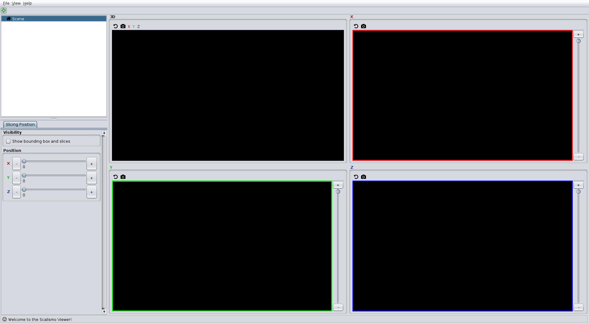

# Using Scalismo with scala-cli and VSCode

In this article we describe how to set up Scalismo, such that it can be used to program shape modelling applications using [VSCode](https://code.visualstudio.com/) as an editor.
This is the recommended setup to get started with developing in Scalismo. It is powerful, but still relatively light-weight, compared to using a full blown IDE such as IntelliJ IDEA.

## Install VSCode

[Download](https://code.visualstudio.com/Download) and install VSCode as described
in the [official documentation](https://code.visualstudio.com/docs/setup/setup-overview).


## Install Scala-CLi
Install [Scala-CLI](https://scala-cli.virtuslab.org/) by following the 
[Installation guide](https://scala-cli.virtuslab.org/install) for your operating system. 


## Running the first Scalismo program

Now we are ready to run our first program. 
Open an editor and create a file ```HelloScalismo.scala``` with the following content:
```scala
//> using scala "3.3"
//> using dep "ch.unibas.cs.gravis::scalismo-ui:0.92.0"

import scalismo.ui.api.ScalismoUI

object HelloScalismo extends App {
    ScalismoUI()
}
```

You can run the program, by calling 
```
scala-cli run HelloScalismo.scala
```

On MacOS, you might have to call instead 
```
scala-cli run --jvm system HelloScalismo.scala
```
in order to instruct `scala-cli` to use the system JVM that you installed before. 

If it runs successfully, you should see the following window appearing



## Setting up VSCode as an IDE

To setup the necessary environment for using VSCode as an ide, the following command can be used. 
```
scala-cli setup-ide .
```
or on MacOS
```
scala-cli setup-ide --jvm system 
```

After starting vscode with the command 
```
code . 
```
(or by starting it from the start menu and choosing *File->Open Folder...*), 
VSCode should appear with the project correctly configured. 
After successful initialization run buttons should appear, with which you can start 
the project.

*On MacOS it might happen that the program crashes when starting it using the run 
buttons. In this case the JVM is not correctly configured. An easy workaround is 
to open a terminal (from within VS Code) and use 
```scala-cli run --jvm system``` as above to run the code. All the other editing features of VSCode (like autocompletion, refactoring, showing syntax errors, etc.) should work with any JVM*
