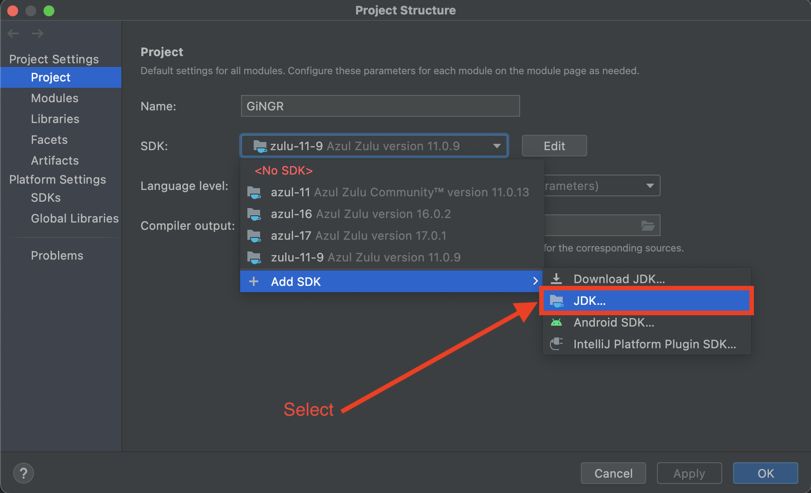

Java continues to be a challenge on the OSX platform. We have recently experienced just how sensitive Scalismo is to using the correct Java version. 

As explained in the [setup guide](https://scalismo.org/docs/ide), we encourage people to install the Zulu version 11.0-9 of JVM using the command line. 

However, when using Zulu JDK in IntelliJ, there is no option to select the specific minor version 9. Unfortunately, the newest version does not always work and might result in the following error when initializing Scalismo:
```
libc++abi: terminating with uncaught exception of type NSException

Process finished with exit code 134 (interrupted by signal 6: SIGABRT)
```
To fix this, we have to manually import the Zulu 11.0-9 JDK downloaded with Coursier from the command line. To do so, we need to know the `java.home` directory. This can be found by starting `sbt` and invoking:
```
eval System.getProperty("java.home")
```
This will produce an output similar to:
```
[info] ans: String = /Users/USERNAME/Library/Caches/Coursier/jvm/zulu@1.11.0-9/zulu-11.jdk/Contents/Home
```
In IntelliJ click File -> Project structure ... -> In the project tap, select `Add SDK` -> `JDK...` (as shown in below image):



We now have to navigate to the folder. Note that the `Library` folder is hidden, and so to see hidden folders, click: CMD+shift+. 

Apply changes and make sure that the SDK is set to the correct Zulu JDK. 