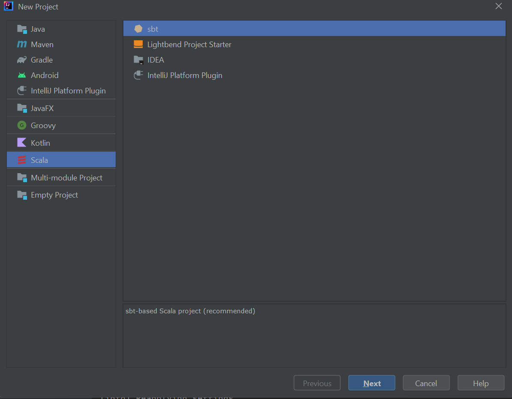
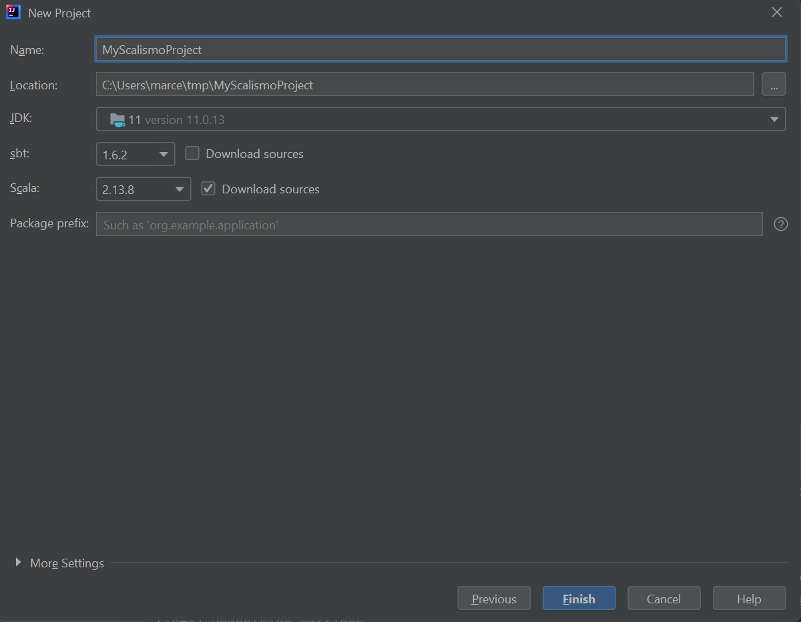
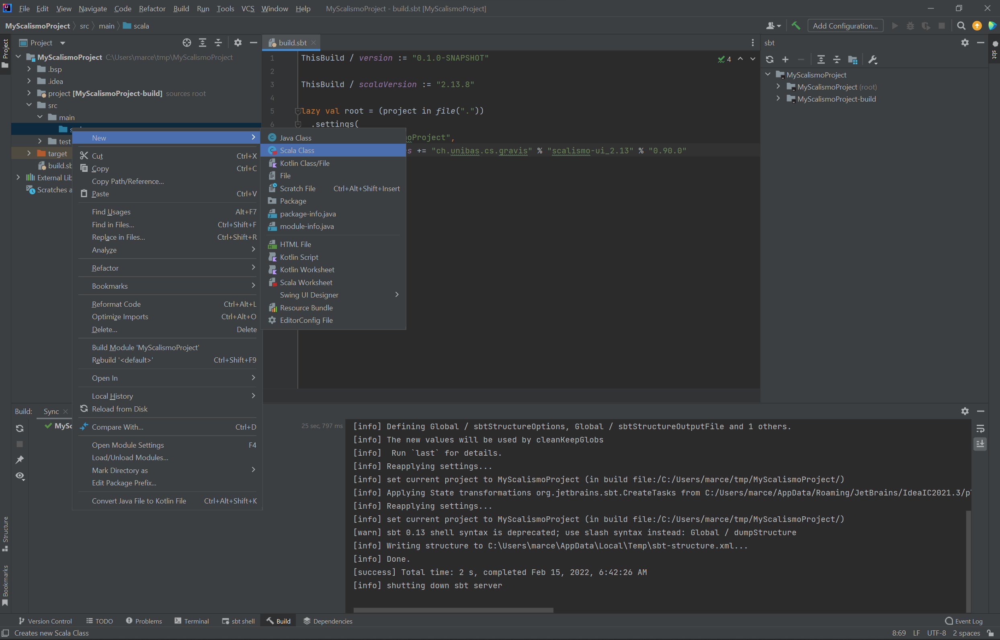
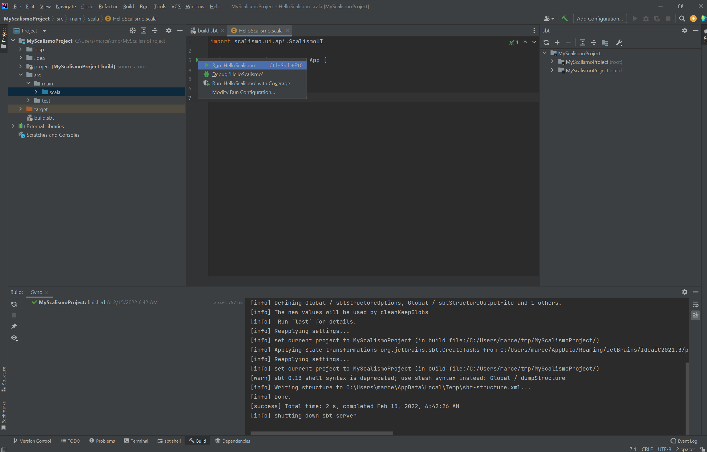

In this article we describe how to set up Scalismo such that it can be used to program shape modelling applications from *IntelliJ IDEA*.

To install IntelliJ, go to the [IntelliJ Idea download page](https://www.jetbrains.com/idea/download/#section=windows), download the *Community edition* and follow the installation instructions. Once we have installed IntelliJ, we will to install the Scala plugin. This is 
installed and enabled from within IntelliJ, as described [here](https://www.jetbrains.com/help/idea/discover-intellij-idea-for-scala.html#).


### MacOS only: Install an older version of the JDK
On MacOS, there is a bug in some of the base libraries that Scalismo-UI is using for visualization, which causes Scalismo-UI to crash on startup. To successfully run Scalismo-UI for visualization, we therefore have to install an older version of the JVM. 
The Zulu JDK 11.0.9 is known to work on both M1 and intel versions of Macs. An installable package for MacOS can be downloaded from [here](https://cdn.azul.com/zulu/bin/zulu11.43.21-ca-fx-jdk11.0.9-macosx_x64.dmg). Please install this JVM and make sure you use it for all the future steps. You can test if the correct JVM is used by typing 
```
java -version
```
in a terminal, which should show a line like:
```
openjdk version "11.0.9"2020-10-20 LTS"
```
If another version is shown, you might have to set the environment variables ```PATH``` and ```JAVA_HOME``` accordingly. 

### Create your first scalismo project

After the Scala plugin has been installed and you see the welcome screen, choose *File->New->Project*.
Choose *Scala*  and *sbt* in the following dialog and press the next button. 


In the following dialog, enter a project name and location. If you are on MacOS, 
choose the JDK you have installed in the previous step. For all the other options, 
you can keep the proposed default values. 


Then continue by clicking onto the *Finish* button.

Now the IDE should set up the project. When you start the IDE for the first time,
there is a lot of processing that is done in the background and it might take a few minutes before the project is ready for use. In the bottom right you can spot an indication for the ongoing work.

Once all the importing is done, you should then be able to navigate through the project folder and find a file called ```build.sbt```.
Add the following line to the ```settings``` section
```
libraryDependencies += "ch.unibas.cs.gravis" %% "scalismo-ui" % "0.90.0"
```
and then choose *Reload all sbt projects* on the sbt tab on the right:


This should now add the scalismo library to your project. 

We are now ready to write our first Scalismo program:  Navigate to the folder
*src/main/scala/* right click on it and choose *new scala class*. 


Give it an appropriate name (such as *HelloScalismo*) and choose *Object* in the list below. This will create a new Scala File, which you can change as follows:
```
import scalismo.ui.api.ScalismoUI

object HelloScalismo extends App {

  val ui = ScalismoUI()
}
```

By choosing run, using for example the green arrow next to the object, you can start 
the program:


### Troubleshooting
If you have problems running Scalismo from IntelliJ but not from the command line, have a look at the [blog post](https://scalismo.org/blog/java-on-osx-problem).

### Other Ressources

* You can find a more detailed overview on how to work with the Scala plugin on the Jetbrains [website](https://www.jetbrains.com/help/idea/discover-intellij-idea-for-scala.html#).
* How to work with Scalismo using IntelliJ is described in this [blog post](http://empty-set.me/index.php/categories-intro/statistical-shape-modeling/) by Behzad Vafaeian.