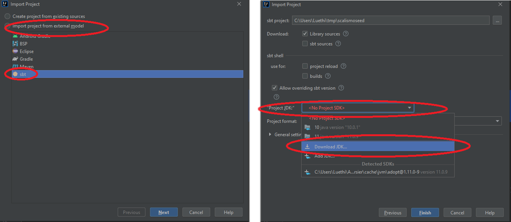
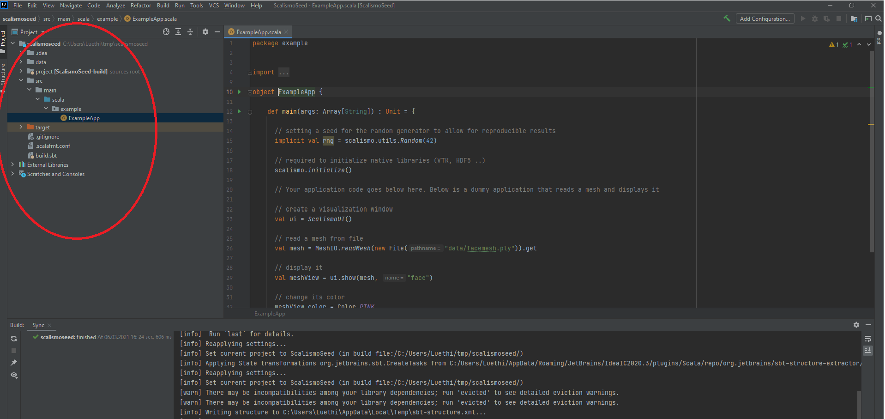

In this article we describe how to set up Scalismo such that it can be used to program shape modelling applications from an Integrated Development Environment (IDE).
For this, we need to set up a Scala development environment (including JDK, a Scala Compiler and a build tool) the source control management system *git* as well as
the IDE. As an IDE we use of *Intellij IDEA*.

## Setting up Scala

To setup a Scala environment, we will use the tool [Coursier](https://get-coursier.io/), which will set up an appropriate JDK, the Scala compiler as well as the Scala build tool (sbt) for us.

On MacOS and Linux, use the following commands to download and install coursier:

```
$ curl -fLo cs https://git.io/coursier-cli-"$(uname | tr LD ld)"
$ chmod +x cs
$ ./cs setup
$ rm -f cs
```

On Windows, open a terminal (cmd.exe not powershell), *navigate to a folder where you have write permissions* and issue the following commands

```
> bitsadmin /transfer cs-cli https://git.io/coursier-cli-windows-exe "%cd%\cs.exe"
> .\cs setup
> del cs.exe
```

*Note, after the setup of coursier you might need to open a new terminal for the ```cs``` command to be found on your system.*

When coursier finds a valid JVM on the system, it will use that. Most JVM versions should work fine, but we recommend to use either Java 8 or Java 11. There is also a known bug in many JVM implementations, which causes Scalismo-ui to crash on startup on MacOS. On MacOS we therefore strongly suggest to use the the Zulu JVM. It can be installed using Coursier as follows:

```
cs java --jvm zulu:1.11.0-9 --setup
```

To see which java version is used by your system, type

```bash
cs java -version
```

*In case this command does not report the right version, you might need to open a new terminal.*

Finally, you may want to know the location, where Coursier installed the JVM. You can find this out by
typing

```
cs java --jvm zulu:1.11.0-9  --env
```


More details on how to work with *coursier* and how to manage JVM versions can be found on the [Coursier Webpage](https://get-coursier.io/docs/cli-overview) and in
this [blog post](https://get-coursier.io/docs/cli-setup).

## Installing Git

In addition to the Scala environment, we will need the *git* source control management system and also an integrated development environment.
To install Git, please go to the [Git website](https://git-scm.com/downloads) and following the download and installation instructions there.

## Getting and building the seed project

In this step we provide you with a small "Hello World" example project.
We download the project  run it from the command line and set up the IDE for the later usage.

To get the project, use the follow command

```bash
sbt new unibas-gravis/scalismo-seed.g8
```

*Note: On Windows this command might report the error, that it was not able to delete some resources. You can ignore this error.*

On the following prompt, enter a name for your project. The seed project will now be available in the subdirectory
with the corresponding name. Change to this directory.

```
cd NAME_OF_YOUR_PROJECT
```

We will now run the project. This will trigger the project to be built by sbt.
Note that the initial build will download some dependencies specific to the project. This may take a while.
The command to run the project is:

```bash
sbt run
```

A successful run should display a Scalismo UI with a pink mean face.

> We have now a working setup of Scalismo and could use any editor to work on the code.
> However, we strongly recommend to use an IDE when working with Scala. Our recommendation
> is to use [IntelliJ idea](https://www.jetbrains.com/idea/).


## Using Scalismo from IntelliJ Idea

In this last step, we will set up Scalismo such that we can use it from the IDE IntelliJ Idea.
To install IntelliJ, go to the [IntelliJ Idea download page](https://www.jetbrains.com/idea/download/#section=windows), download the *Community edition* and follow the installation instructions. Once we have installed IntelliJ, we will to install the Scala plugin. This is
installed and enabled from within IntelliJ, as described [here](https://www.jetbrains.com/help/idea/discover-intellij-idea-for-scala.html#).


After the Scala plugin has been installed and you see the welcome screen, choose *File->New->Project From Existing Sources*.
Then navigate to the folder containing the seed project directory. In the next dialog select the option: *Import project from external model* and select *sbt* as a model (see screenshots below).

In the next dialog you need to choose the right *Project JDK*. If your system required you to use the Zulu JDK in the previous step, go to *Project JDK*, choose Download JDK and select
*Version 11* and as Vendor *Azul Zulu Community* and then press the *Download* button.

Then continue by clicking onto the *Finish* button.



Now the IDE should import the project. When you start the IDE for the first time,
there is a lot of processing that is done in the background and it might take a few minutes
before the project is ready for use. In the bottom right you can spot an indication for the ongoing work.

Once all the importing is done, you should then be able to navigate through the project folder to
```src/main/scala/com/example/``` and double-click *ExampleApp*.
This will open the code of the application we have already executed before from the console using sbt.

To execute the file from within the IDE right-click the source file and click *Run*.



### Troubleshooting

If you have problems running Scalismo from IntelliJ but not from the command line, have a look at the [blog post](https://scalismo.org/blog/java-on-osx-problem).

### Other Ressources

* You can find a more detailed overview on how to work with the Scala plugin on the Jetbrains [website](https://www.jetbrains.com/help/idea/discover-intellij-idea-for-scala.html#).
* How to work with Scalismo using IntelliJ is described in this [blog post](http://empty-set.me/index.php/categories-intro/statistical-shape-modeling/) by Behzad Vafaeian.

